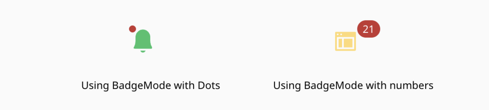
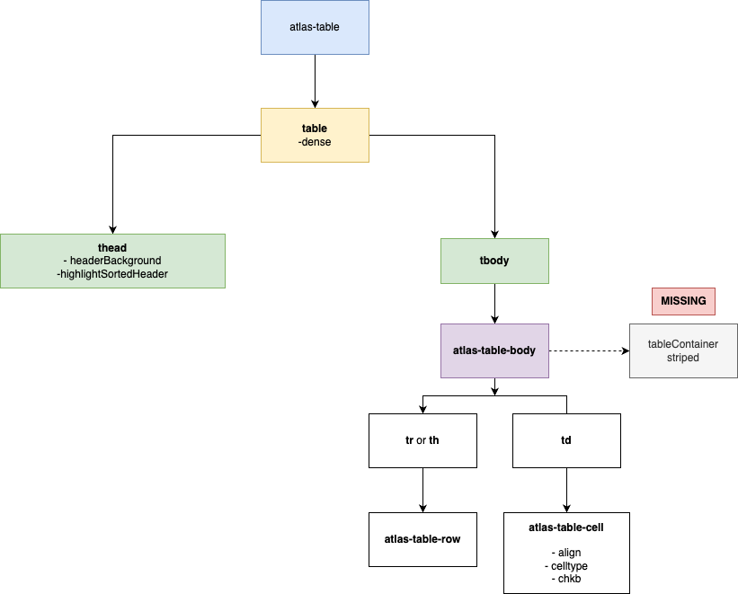
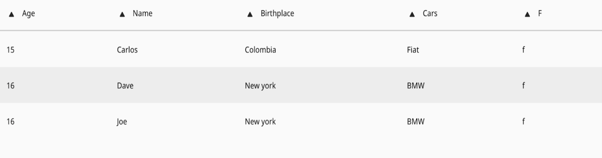

# 🚀 Atlas Migration: Your Guide to a Seamless Transition

- [🚀 Atlas Migration: Your Guide to a Seamless Transition](#-atlas-migration-your-guide-to-a-seamless-transition)
  - [📑 Table of Contents](#-table-of-contents)
  - [📢 Introduction](#-introduction)
  - [✅ Main Recommendations](#-main-recommendations)
  - [⚠️ Before Migration](#-before-migration)
  - [🚀 Steps to Execute the Script](#-steps-to-execute-the-script)
    - [Option 1: Install the package manually](#option-1-install-the-package-manually)
    - [Option 2: Install the package from GitHub Packages](#option-2-install-the-package-from-github-packages)
  - [⚙️ Migration Configuration File](#️-migration-configuration-file)
    - [Option 1: Use the Config Generator (Recommended)](#option-1-use-the-config-generator-recommended)
    - [Option 2: Manual Configuration](#option-2-manual-configuration)
  - [💻  Running the Script](#--running-the-script)
  - [🛠️ Post-migration](#️-post-migration)
    - [📝 Understanding What Has Been Migrated: Migration Types](#-understanding-what-has-been-migrated-migration-types)
      - [Direct Transformations](#direct-transformations)
      - [Custom Transformations](#custom-transformations)
      - [Legacy Component Transformations](#legacy-component-transformations)
  - [🐞 Troubleshooting Common Problems](#-troubleshooting-common-problems)
    - [Theming Not Applied](#theming-not-applied)
    - [Issue After Upgrading RxJS](#issue-after-upgrading-rxjs)
    - [References to types/interfaces in TS and HTML Files](#references-to-typesinterfaces-in-ts-and-html-files)
    - [MOSUI Class Compatibility](#mosui-class-compatibility)
    - [Removing the MosUI Services](#removing-the-mosui-services)
    - [mosConfig.assetUrl implementations](#mosconfigasseturl-implementations)
    - [Specific Implementations](#specific-implementations)
    - [Unmatched Attributes](#unmatched-attributes)
    - [Unmatched Methods](#unmatched-methods)
  - [NX Workspaces](#nx-workspaces)
    - [I don't have angular.json file](#i-dont-have-angularjson-file)
    - [I ran the migration, but the changes are not visible in the code editor](#i-ran-the-migration-but-the-changes-are-not-visible-in-the-code-editor)
  - [🧩 Component-Specific Migration Guidelines](#-component-specific-migration-guidelines)
    - [Modal Transformation Caveats](#modal-transformation-caveats)
    - [Brighter Modals without Action Buttons in the Footer](#brighter-modals-without-action-buttons-in-the-footer)
    - [Datepicker](#datepicker)
    - [Mosui Circle](#mosui-circle)
    - [Variables](#variables)
    - [Icons](#icons)
    - [Icon Badge](#icon-badge)
    - [Brighter Avatar and Mercer Avatar](#brighter-avatar-and-mercer-avatar)
    - [Footer](#footer)
    - [Alert](#alert)
    - [Table](#table)
    - [Pagination](#pagination)
    - [Migration of MOSUI toast to Atlas snackbar](#migration-of-mosui-toast-to-atlas-snackbar)
      - [HTML](#html)
      - [TypeScript](#typescript)
    - [Migration of Brighter/MOSUI Chip](#migration-of-brightermosui-chip)
      - [Flags in MOSUI Chip](#flags-in-mosui-chip)
    - [Migration of MOSUI Data Table](#migration-of-mosui-data-table)
      - [Changes Required](#changes-required)
      - [Full Example](#full-example)
    - [Migration of MOSUI Table](#migration-of-mosui-table)
    - [Migration of MOSUI HCard (experimental component)](#migration-of-mosui-hcard-experimental-component)
    - [Migration of MOSUI Social-Badge to Atlas Icon](#migration-of-mosui-social-badge-to-atlas-icon)
    - [Migration of MOSUI mos-multi-option, mercer-option to Atlas option](#migration-of-mosui-mos-multi-option-mercer-option-to-atlas-option)
    - [Migration of MOSUI mercer-progress-circle to atlas-progress](#migration-of-mosui-mercer-progress-circle-to-atlas-progress)
      - [Property and Attribute Changes](#property-and-attribute-changes)
    - [Migration of MOSUI mercer-card](#migration-of-mosui-mercer-card)
    - [Migration of MOSUI mercer-list](#migration-of-mosui-mercer-list)
      - [Nav List](#nav-list)
    - [Migration of MOSUI mercer-brand-bar](#migration-of-mosui-mercer-brand-bar)
    - [Migration of MOSUI mercer-autocomplete](#migration-of-mosui-mercer-autocomplete)
    - [Mercer Country Select](#mercer-country-select)
      - [Recommendations](#recommendations)
  - [📂 Appendices](#-appendices)
    - [APPENDIX A: Configuration Parameters](#appendix-a-configuration-parameters)
  - [Config Generator Steps](#config-generator-steps)
  - ["Happy path" Example of the `brighter-to-atlas-params.json`](#happy-path-example-of-the-brighter-to-atlas-paramsjson)
  - [Customizing the Start Path](#customizing-the-start-path)
  - [📌 Table: Property Descriptions](#-table-property-descriptions)
    - [APPENDIX B](#appendix-b)
      - [Unmatched Properties](#unmatched-properties)
    - [APPENDIX C](#appendix-c)
      - [Brighter Components Equivalency Table](#brighter-components-equivalency-table)
      - [MOSUI Components Equivalency Table](#mosui-components-equivalency-table)
      - [Notes](#notes)
    - [🪦 Deprecated UI Packages](#-deprecated-ui-packages)

## 📢 Introduction

The Atlas Migration script helps transition components from the Brighter/MOSUI design system to the Atlas design system.
This project is built around a [**Angular Schematics**](https://angular.dev/tools/cli/schematics-authoring) script designed to streamline the migration to Atlas, taking into account **component.html and styles updates, module imports, modifications to package.json**, and more.

This document includes recommendations on:

- **Preparing for the migration**
- **Running the script**
- **Troubleshooting common issues**

We understand that the migration process cannot be entirely automated and may require some manual adjustments. This guide aims to assist developers in expediting the transition of components from Brighter/MOSUI to Atlas as efficiently as possible. We hope you find it valuable and encourage you to share your feedback to help us refine and enhance the process!

Thank you,  
**The Atlas Team**

## ✅ Main Recommendations

- **Understanding the Design System**: Before starting the migration, familiarize yourself with the Atlas Component Library and Design System. This understanding will greatly facilitate the migration process.
- **Component Equivalents**: Most components in the old UI packages have equivalents in the Atlas Design System. Refer to the [Atlas Component Equivalency Guide](#appendix-c) for specifics.
- **Document Native Brighter/MOSUI Components**: Keep a record of all the native Brighter/MOSUI components used in your product. This will serve as a reference during the migration process and help provide better support afterward.
- **Remove Commented Code**: Delete all commented code from your HTML files to avoid potential errors during the migration process.
- **Ensure your code is properly formatted** to avoid incorrect transformations. Tools such as Prettier or ESLint can help with this.
- **Create a new branch with no changes**, ensuring that all existing changes are committed beforehand. This will allow you to clearly review the modifications made once the script has been executed.

- **Modals**: Verify your modals match the required criteria—if using `<mercer-modal>`, see [Modal Transformation Caveats](#modal-transformation-caveats).

## ⚠️ Before Migration

On the `package.json` of the project you are going to migrate, ensure that the following dependencies are present:

- **Angular Version**: Ensure your project’s base code is updated to Angular 17 (ng17) or above and that **Angular CLI** is installed.
- **RxJS Version**: Verify that it includes RxJS version 7.4.0 or above.
- **Luxon Dependency**: Luxon is required in Atlas for components that handle date types. Ensure that Luxon is included and is set to version `^2.3.2`. If it is not present or is at a different version, add or update it accordingly.

## 🚀 Steps to Execute the Script

### Option 1: Install the package manually

1. Download the package from the following link:
  <a target="_blank" download href="./lib-atlas-migration.tgz">
      <strong>lib-atlas-migration.tgz</strong>
  </a>

2. Place the `lib-atlas-migration.tgz` file in the root directory of your project.

3. Modify the `package.json` file of your project to include the following:

```json
"devDependencies": {
  "lib-atlas-migration": "file:lib-atlas-migration.tgz"
}
```

> ⚠️ **IMPORTANT**: Ensure that the `lib-atlas-migration.tgz` file is located in the root directory of your project. If you place it in a different location, update the path accordingly in the `package.json` file.

4. Install the package by running the following command:

```bash
npm install
```

or if you encounter compatibility issues, add the `--legacy-peer-deps` flag to the command.

```bash
npm install --legacy-peer-deps
```

### Option 2: Install the package from GitHub Packages

1. To install the library from **GitHub Packages**, ensure your registry is configured as follows:

```bash
@mmctech:registry=https://npm.pkg.github.com/
//npm.pkg.github.com/:_authToken=YOUR-GITHUB-TOKEN
registry=https://registry.npmjs.org/
```

Replace YOUR-GITHUB-TOKEN with your personal access token. You can generate a token by following the instructions in the [GitHub documentation](https://docs.github.com/en/packages/working-with-a-github-packages-registry/working-with-the-npm-registry#authenticating-to-the-registry).

> 💡 **NOTE:** You can configure this globally or specifically for your project by creating a `.npmrc` file and adding the lines mentioned above.

2. Go to the root directory of your frontend project repository that you wish to migrate to Atlas, and execute the following command:

```bash
npm install lib-atlas-migration@npm:@mmctech/lib-atlas-migration --save-dev
```

or if you encounter compatibility issues, add the `--legacy-peer-deps` flag

```bash
npm install lib-atlas-migration@npm:@mmctech/lib-atlas-migration --save-dev --legacy-peer-deps
```

## ⚙️ Migration Configuration File

After installing the package, you need to create a configuration file named `brighter-to-atlas-params.json`. The `brighter-to-atlas-params.json` file is a configuration file that stores essential parameters required for the migration process from **Brighter/MOSUI** to **Atlas**. This file must be correctly configured before running the migration script. To help you with the creation of this file, we just created the [Config Generator](#option-1-use-the-config-generator-recommended) script.

### Option 1: Use the Config Generator (Recommended)

The **Config Generator** script streamlines the creation of the `brighter-to-atlas-params.json` configuration file . You can use this script to automate the process or manually create the file by following the steps provided below.

To run the script, follow these steps:

1. On the root directory of your frontend project repository, execute the following command:

```sh
  ng g lib-atlas-migration:config
```

For **NX projects**, use the following command:

```sh
npx nx g lib-atlas-migration:config
```

> ‼️ **IMPORTANT: For Angular v17, migrate to Atlas v8.0.0. For Angular v18, migrate to Atlas v9.0.0.**

1. Follow the on-screen instructions. You can press `Enter` to accept the default values or enter your custom values.

If you want a detailed explanation of every step, please refer to the [Config Generator Steps](#config-generator-steps).

### Option 2: Manual Configuration

If you prefer to do the process manually:

1. Place the `brighter-to-atlas-params.json` file in the root directory of your project (Note: exact file name is required). For an example of the file structure and detailed explanations of each parameter, see [Table: Property Descriptions](#-table-property-descriptions)
2. Open the file and update the variables with your project-specific information.

## 💻  Running the Script

Once everything is set up, you can finally run the migration script.

1. On your frontend root folder, run the following command:

```bash
ng g lib-atlas-migration:atlas-migration
```

For **NX projects**, use the following command:

```sh
npx nx g lib-atlas-migration:atlas-migration
```

> 🎉 **If everything is set up correctly, the script will start running. You should see all the changes reflected in your terminal and code editor.**

2. Check your `package.json` or manifest files are ok and add the new Atlas dependencies to your project:

```bash
npm i
```

or, if you encounter compatibility issues:

```bash
npm i --legacy-peer-deps
```

> ⚠️ If errors occur, refer to the [troubleshooting section](#-troubleshooting-common-problems).

## 🛠️ Post-migration

- **Check manifest files**: `package.json`, `package-ci.json` if they are ok.
- **Remove deprecated UI Packages**: to assure everything is working as it should make sure to remove [deprecated UI Packages](#-deprecated-ui-packages) and Services.
- **Run sanity testing on your product** to ensure the product functions as expected after migration
- **Identify breaking changes and discrepancies and log them**
- **Manually fix/correct customized components within your project** i.e. if you have tweaked a component within your project code, the script will not have converted it into anything in Atlas.
- **Identify Brighter/MOSUI components that were not migrated** and validate that there is no equivalent Atlas component; plan for an experimental component mapping.
- **Identify icons that were not migrated**. The script execution will output a `xxx.log` file with the list of the icons in your project without an equivalent in Atlas, you need to decide whether to replace them with Atlas-supported icons or create a custom solution.
- **Share your findings**. Document all issues encountered during the migration process, create a [GitHub issue](https://github.com/mmctech/brighter-to-atlas/issues), and share them with the Atlas team.
- **Remember** that the transformations are for components and attributes, methods and class depend on the project.

### 📝 Understanding What Has Been Migrated: Migration Types

Ok, you have completed the migration. You may notice that various files have been modified in your code editor, but we will focus on the HTML files for now. As you can see, different changes have been made to the components. Let's go through them to understand these modifications better. Your component may have been migrated directly, undergone a custom transformation, or been transformed into a Legacy component.

#### Direct Transformations

This migration process involves several specific considerations. The type of migration can be direct, meaning that a component with a matching name is migrated along with its properties. For example, a component like `<mercer-icon>` is transformed into `<atlas-icon>`, with its properties adjusted accordingly. If a direct match exists, such as a property containing `icon`, it is mapped while preserving its content or mapped to a new content, depending on each case. This type of migration is the most common and occurs in the majority of cases.

**Before:**

```html
<mercer-icon
  icon="add_shopping_cart"
  size="xlg"
  alt="Add items to shopping cart"
  color="info"
></mercer-icon>
```

**After:**

```html
<atlas-icon
  icon="icon-shopping-cart-add-24" 
  collection="system"
  size="large"
  alt="Add items to shopping cart"
  color="info"
></atlas-icon>
```

In this transformation, properties can be modified, new properties can be added, and others may be [removed as needed](#unmatched-properties).

#### Custom Transformations

Another type of transformation occurs when there is no direct one-to-one equivalent in Atlas. Unlike the common direct transformations, these cases require experimental custom transformations. These transformations restructure the original component into a structured `<div>` layout while maintaining its original functionality. Sometimes, these transformations involve converting the component into structural `<div>` elements, while other times, it is a combination of `<div>` elements and existing Atlas components that partially replicate the original component's functionality.

**Before:**

```html
<mercer-pull-quote
  cite="Investments & Retirement, ACME"
  class="src-c-landing-page-reviews__quote mos-u-spacer--padding-left-lg"
>
  <p class="mos-u-color-text--primary mos-u-font-weight--bold">
    Investing wisely today is not just about growing wealth, but about securing a future where you can retire with confidence, freedom, and peace of mind.
  </p>
  <span class="mos-u-spacer--padding-top-sm mos-u-spacer--margin-bottom-none mos-u-font-weight--medium mos-u-text-size--md">
    Marion Garland
  </span>
</mercer-pull-quote>
```

**After:**

```html
<div class="row margin-top-8">
  <blockquote style="color: var(--colors-action-primary-main-contained); font-weight: bold">
    Investing wisely today is not just about growing wealth, but about securing a future where you can retire with confidence, freedom, and peace of mind.
    <div class="padding-top-4 margin-bottom-0" style="font-size: var(--semanticTypography-font-size-body-large); color: var(--colors-text-primary-secondary)">
      Marion Garland
    </div>
    <cite style="display: block;" class="margin-top-2">Investments & Retirement, ACME</cite>
  </blockquote>
</div>
```

Inline CSS styles are initially used for rapid prototyping; however, it is recommended to migrate these styles to an SCSS file when integrating the final component into a project. These experimental transformations are subject to further iterations and refinements based on real-world usage and feedback. Moving forward, evaluating their adaptability and optimizing styling practices for maintainability and scalability is crucial.

#### Legacy Component Transformations

Lastly, another approach involves migrating components to their corresponding **Legacy** components in Atlas. Due to the complex nature of the original component, this approach ensures a smoother transition while maintaining functionality. These components retain identical functionality while only changing the selector name. For example, `<mercer-dropdown>` is renamed `<legacy-dropdown>`, and its styles are adjusted for compatibility. While these components are useful for migration purposes, it is advisable to reassess their usage and consider adopting existing or future components, **as they are deprecated and will not be supported**.

**Before:**

```html
<mercer-dropdown [position]="'right'" theme="secondary">
  <mercer-dropdown-label>
    <button mercer-button type="button" icon="keyboard_arrow_down" iconPosition="right">Dropdown</button>
  </mercer-dropdown-label>
  <mercer-dropdown-item>
    <a href="#"><mercer-icon size="sm" icon="person" alt="Account"></mercer-icon>Account</a>
  </mercer-dropdown-item>
  <mercer-dropdown-item>
    <a href="#"><mercer-icon size="sm" icon="settings" alt="Settings"></mercer-icon>Settings</a>
  </mercer-dropdown-item>
  <mercer-dropdown-item>
    <a href="#"><mercer-icon size="sm" icon="lock_open" alt="Logout"></mercer-icon>Logout</a>
  </mercer-dropdown-item>
</mercer-dropdown>
```

**After:**

```html
<legacy-dropdown [position]="'right'" theme="secondary">
  <leagacy-dropdown-label>
    <atlas-button type="button">Dropdown<atlas-icon icon="icon-chevron-down-24" collection="system"></atlas-icon></atlas-button>
  </legacy-dropdown-label>
  <legacy-dropdown-item>
    <a href="#"><atlas-icon size="small" icon="icon-profile-24" collection="system" alt="Account"></atlas-icon>Account</a>
  </legacy-dropdown-item>
  <legacy-dropdown-item>
    <a href="#"><atlas-icon size="small" icon="icon-settings-24" collection="system" alt="Settings"></atlas-icon>Settings</a>
  </legacy-dropdown-item>
  <legacy-dropdown-item>
    <a href="#"><atlas-icon size="small" icon="icon-padlock-unlock-24" collection="system" alt="Logout"></atlas-icon>Logout</a>
  </legacy-dropdown-item>
</legacy-dropdown>
```

In conclusion, these migration strategies provide different approaches depending on the component structure and its compatibility within Atlas. While direct transformations offer seamless property mapping, custom transformations enable non-equivalent components to be restructured, and legacy components ensure backward compatibility. The goal is to enhance maintainability and optimize component usage in the long run.

## 🐞 Troubleshooting Common Problems

### Theming Not Applied

If the theming defined in `app.component.ts` isn't being applied, the cause is a mismatch between the project folder name and the `projectName` defined in `angular.json`.

By default, Angular sets the `projectName` in `angular.json` to match the root folder name of the project (e.g., a folder named `atlas-migration` would usually have `"projectName": "atlas-migration"`). However, in some cases this may not be true — for example, the project might use a custom name like `"test-project"`.

To handle this scenario, the `brighter-to-atlas-params.json` file includes a `projectName` field that can be used to explicitly define the correct project name. This field was previously unused but is now required in these edge cases.

**Solution**: Make sure to include the correct `projectName` in your `brighter-to-atlas-params.json` file. For example:

```json
{
  "projectName": "test-project"
}
```

Alternatively, you can complete the process by following [this guide](?path=/docs/adopters-design-theming--docs) manually.

### Issue After Upgrading RxJS

After upgrading RxJS, you might encounter issues related to the use of `ReplaySubject`. To resolve this, replace `ReplaySubject` with `Subject`. Ensure you review and test the functionality to confirm the change does not affect expected behavior.

e.g.

```typescript
private _destroyed$: ReplaySubject<boolean> = new ReplaySubject(1);
```

To:

```typescript
private _destroyed$: Subject<void> = new Subject<void>();
```

### References to types/interfaces in TS and HTML Files

References to types/interfaces from Brighter in TypeScript or HTML files will not be automatically replaced during migration. You need to manually update these references to their Atlas equivalents.

**Before:**

```typescript
import { BrighterSizes } from 'merceros-ui-components/experimental-brighter';
brighterSizes = BrighterSizes;
```

**After:**

```typescript
import { ButtonSizings } from 'atlas-button';
buttonSizings = ButtonSizings;
```

Change the class or property from Atlas in HTML:

**Before:**

```html
<button brighter-button [brighterSize]="brighterSizes.medium">
  Download
</button>
```

**After:**

```html
<atlas-button [size]="buttonSizings.medium">
  Download
</atlas-button>
```

### MOSUI Class Compatibility

To maintain compatibility during migration, several important MosUI classes have been preserved in the legacy stylesheet files:

- `legacy.scss`
- `legacy_shared_mosui.scss`

The following core components have been included in these legacy files:

- **Animations**
- **Colors**
- **Fonts**
- **Functions**
- **Global styles**
- **Mixins**
- **Types**
- **Foundations**

### Removing the MosUI Services

After running the migration script, manually remove `MosSVGInlinerService` from `app.module`:

```typescript
providers: [MosSVGInlinerService], // remove
bootstrap: [AppComponent],
schemas: [CUSTOM_ELEMENTS_SCHEMA],
...
export class AppModule {
 constructor(
  mosSVGInlinerService: MosSVGInlinerService, // remove
  mosConfigurationService: MosConfigurationService // remove
 ) {
  mosSVGInlinerService.preloadAll(); // remove
  mosConfigurationService.setFormV2(true); // remove
 }
}
```

### mosConfig.assetUrl implementations

Since `MosConfigurationService` is not available in Atlas, you need to replace the `mosConfig.assetUrl` implementation in your HTML files.

Before:

```html
<mercer-hero backgroundUrl="{{mosConfig.assetUrl}}img/sample-bg.jpg" minHeight="576"></mercer-hero>
```

After:

```html
<legacy-hero backgroundUrl="../assets/img/sample-bg.jpg" minHeight="576"><legacy-hero>
```

### Specific Implementations

- Brighter classes, such as `align-center` or `justify-content`, should be replaced with custom classes.
- Some classes are not available in Atlas, so the developer must determine the best way to replace these custom classes to suit the specific needs of the project.

### Unmatched Attributes

Certain attributes will be removed from components as there is no direct equivalent in the corresponding Atlas component. For more details, refer to [APPENDIX B](#unmatched-properties).

### Unmatched Methods

Methods are not migrated, each method depends on the specific component. Transformations are for components and attributes.

## NX Workspaces

### I don't have angular.json file

If you are using NX workspaces, `angularConfigFilePath` should be the path to your `project.json` file. Since it allows only one path at the moment, you should run the migration script for one project and then copy the changes to the other projects.

```json
{
  "angularConfigFilePath": "apps/your-app/project.json"
}
```

### I ran the migration, but the changes are not visible in the code editor

If you don't see the migration changes in your code editor, try refreshing it. In Visual Studio Code, you can press `Ctrl + Shift + P`, type `Reload Window`, and select it to refresh the editor. This should display the updated files and changes made by the migration script.

## 🧩 Component-Specific Migration Guidelines

### Modal Transformation Caveats

It's important to note that the modal transformation process may not produce the desired output if the original modal structure in the migrated application did not adhere to a specific pattern. Specifically, the migration tool expects the `<mercer-modal>` component to act as a wrapper encompassing the header (`<mercer-modal-header>`), content (`<mercer-modal-content>`), and footer (`<mercer-modal-footer>`) components.

**Explanation:**

If a modal was implemented without this clear hierarchical structure, the automatic transformation might fail to correctly identify and map the corresponding Atlas modal components. This could lead to incorrect transformations in the form of <temp-modal-header>, <temp-modal-content> and <temp-modal-footer>

**Example of an incorrect modal structure:**

```html
<mercer-modal-header>
  <h2>Modal Title</h2>
</mercer-modal-header>
<mercer-modal-content>
  <p>Modal content goes here.</p>
</mercer-modal-content>
<mercer-modal-footer>
  <button>Close</button>
</mercer-modal-footer>
```

**Recommendation:**

When migrating applications containing modals, carefully review the original modal implementations. Ensure that `<mercer-modal>` correctly wraps its constituent parts. After making these corrections, revert the previous migration changes and rerun the migration process to observe the accurate outcome.

**Example of a correct modal structure:**

```html
<mercer-modal>
  <mercer-modal-header>
    <h2>Modal Title</h2>
  </mercer-modal-header>
  <mercer-modal-content>
    <p>Modal content goes here.</p>
  </mercer-modal-content>
  <mercer-modal-footer>
    <button>Close</button>
  </mercer-modal-footer>
</mercer-modal>
```

**Example of a transformed modal structure:**

```html
<div>
<atlas-modal
  #testModal
  [headerRef]="FirstModalheader"
  [contentRef]="FirstModalcontent"
  [footerRef]="FirstModalfooter"
  >
</atlas-modal>
  <ng-template #testModalheader>
    <h1>Test Modal Example</h1>
  </ng-template>
  <ng-template #testModalcontent>
    <p>
      <b>This is an example of the modal component</b>
    </p>
    <p>Including a header, content and footer</p>
  </ng-template>
   <ng-template #testModalfooter>
    <atlas-button variant="contained" color="brand">Footer Action</atlas-button>
  </ng-template>
    <atlas-button (click)="testModal.launch()" variant="contained" color="brand">Open Test Modal</atlas-button>
</div>
```

### Brighter Modals without Action Buttons in the Footer

Dev should hide actions within the modal

### Datepicker

Please review [this documentation](?path=/docs/adopters-components-datepicker-readme--docs) to configure format & locale for dates.

### Mosui Circle

To maintain the appearance of circles in your application, you can utilize styles from MOSUI. Specifically, refer to the `legacy-mosui.scss` file to find the necessary class for the circle.

### Variables

Some variables are not available in Atlas.
For example, `$gel-font-file-path` from `typographyv3.scss` should not be used, as typography already defines the font, family, and other related properties.

### Icons

Some icons are not available in Atlas. The log file will identify icons that do not match. Developers should either replace them with the correct icons or download the missing icons and use the `iconSheetUrl` property with the path where the icon is located. See this example:

```jsx
<atlas-icon
  iconSheetUrl="assets/icons/pin-map.svg"
  color="black"
  icon="pin-map"
  size="small">
</atlas-icon>
```

assets/icons/pin-map.svg:

```xml
<svg xmlns="http://www.w3.org/2000/svg" width="24" height="24" viewBox="0 0 24 24">
  <symbol id="pin-map">
    <path d="M9.86088 2C6.80001 2 3.60001 4.36522 3.60001 8.26087C3.60001 11.9478 9.16522 17.5826 9.37392 17.7913C9.51305 17.9304 9.65218 18 9.86088 18C10.0696 18 10.2087 17.9304 10.3478 17.7913C10.5565 17.5826 16.1217 11.9478 16.1217 8.26087C16.1217 4.36522 12.9217 2 9.86088 2ZM9.86088 10.3478C8.67827 10.3478 7.77392 9.44348 7.77392 8.26087C7.77392 7.07826 8.67827 6.17391 9.86088 6.17391C11.0435 6.17391 11.9478 7.07826 11.9478 8.26087C11.9478 9.44348 11.0435 10.3478 9.86088 10.3478Z" fill="currentColor"/>
  </symbol>
</svg>
```

Make sure the id is included in the SVG file, like in the following example: `<symbol id="pin-map">`. Additionally, this id must match the icon prop on the `atlas-icon` component.

### Icon Badge

Since the `mercer-icon` badge directive only uses the `mos_icon_badge_notifications` as a value, the migration script will update the directive to `badgeMode="dot"` and `badge="null"`.

For future implementations, the team can also decide to use numbers instead of "dot" to display numbers, as `badgeMode="numbers"`, and `badge="1"` or `badge="index"` (in case of an iterable element).

The current migration script is designed to handle a specific scenario: instances where the `mercer-icon` badge directive exclusively uses the `mos_icon_badge_notifications` value. In these cases, the script automatically updates the directive to `badgeMode="dot"` and `badge="null"`. This ensures consistency and compatibility with the new system.

```jsx
<atlas-icon
  icon="icon-notification-24"
  collection="system"
  size="large"
  alt="notifications"
  color="success"
  badgeMode="dot"
  badge="null"
  badgePosition="top-right"
  badgeAction="error">
</atlas-icon>
```

However, it's important to consider future implementations and potential enhancements. For example, the team might decide to display numerical values on badges instead of using a simple dot. This can be achieved by setting `badgeMode="numbers"` and then specifying the desired number using `badge="1"` (or another numerical value). If the badge is associated with an iterable element, the `badge="index"` attribute can be used to dynamically display the corresponding index value. By incorporating these options and providing flexibility for future badge configurations, the system can better accommodate evolving requirements and user preferences.

```jsx
<atlas-icon
  icon="icon-notification-24"
  collection="system"
  size="large"
  alt="notifications"
  badgeMode="numbers"
  badge="21"
  badgePosition="top-right"
  badgeAction="error"
  badgeCustomClass="active">
</atlas-icon>
```



### Brighter Avatar and Mercer Avatar

In **version 7**, the avatar size is only available as **"default"**. However, in **version 8**, multiple sizes are available: **default, small, medium, large, xlarge, and xxlarge**. For migration purposes, the transformation has been made compatible with version 8, which might cause the avatar to appear broken until you upgrade to version 8. Please verify this, and if the issue occurs, either remove the attribute or set it to **"default"**.

### Footer

The migration of the `<brighter-footer>` and `<mercer-footer>` is performed to an Atlas legacy footer created based on the Brighter one.

### Alert

If you use a `div` with the class `row`, please ensure to check this class, as `max-width` is not required.

```css
.row {
  /* max-width: 75rem; */
}
```
### Table

To get order functionality on tables, please use the sort feature. This approach is necessary to ensure compatibility with the latest version of the component.

Import dependencies for the library into your ```app.module.ts``` file

```ts

import {  TableModule } from 'atlas-table';
import {  CdkModule } from 'atlas-cdk';

```

**Check HTML code: #header, columnDef, sort:header.sortOption**

```html
<atlas-table [dense]="dense">
  <thead atlas-table-header #header>
    <tr atlas-table-row>
      <th
        atlas-table-header-cell
        *ngFor="let col of columnDef"
        [columnDef]="col" [collection]="'arrows'" [icon]="'arrow-up'" iconSize="xsmall">>
        {{ col.displayLabel }}
      </th>
    </tr>
  </thead>
  <tbody atlas-table-body>
    <tr
      atlas-table-row
      *ngFor="let row of rows | sort:header.sortOption"
      [border]="border"
      [isSelected]="isSelected"
    >
      <td atlas-table-cell [cellType]="cellType" [align]="align">
        {{ row.age }}
      </td>
      ...
```

**Check TS code: ColumnDef is required in the new version.**

```ts
import { ColumnDef, Sortable } from 'atlas-table';

columnDef: ColumnDef[] = 
  [ { displayLabel: ‘name’,  fieldKey: ‘name’, sortable: true },
    { displayLabel: 'description', fieldKey: 'descr',
      sortable: { direction: 'desc', sortOnLoad: false } as Sortable },
    { displayLabel: 'age', fieldKey: 'age', sortable: true }
  ]
```

It is important to note that #header, columnDef and sort:header.sortOption are required in the new version.

### Pagination

This approach is for `mercer-pagination`, as `brighter-pagination` lacks a page number selector and the transformation must be done manually. To ensure backward compatibility, Atlas introduced the `paginationInfoRequest` output. This output is triggered when a change is made to the page number selector, which is accessible via the same input as the previous component, `showLimitOptions`.

**Before:**

```html
<mercer-pagination
  (paginationInfoRequest)="updatePage($event)"
  [paginationInfo]="paginationInfo"
  [showLimitOptions]="true"
></mercer-pagination>
```

**After:**

```html
<atlas-pagination
  (paginationInfoRequest)="updatePage($event)"
  [paginationInfo]="paginationInfo"
  [showLimitOptions]="true"
></atlas-pagination>
```

It is important to note that although both components have `paginationInfo`, their interfaces have changed, requiring necessary adjustments.

**Before:**

```typescript
export interface PaginationInfo {
  offset: number;
  limit: number;
  totalCount?: number;
  limits?: number[];
}
```

**After:**

```typescript
export interface PaginationInfo {
  page: number;
  itemsByPage: number;
  total: number;
}
```

To update the `updatePage` method to work with the new `paginationInfoRequest` output, you need to adjust the method to handle the new `PaginationInfo` interface. For example:

**Before:**

```typescript
  public updatePage(event: PaginationInfo): void {
    this.paginationInfo.limit = event.limit;
    this.paginationInfo.offset = event.offset;
  }
```

**After:**

```typescript
  public updatePage(event: PaginationInfo): void {
    this.paginationInfo = { ...this.paginationInfo, page: event.page, itemsByPage: event.itemsByPage };
  }
```

### Migration of MOSUI toast to Atlas snackbar

To transform MOSUI toast to Atlas snackbar, follow these modifications in your TypeScript and HTML files. Manual updates are required.

#### HTML

```html
<div [style.display]="'flex'" [style.gap.px]="'10'">
  <atlas-button (onClick)="launchSnackbar()">Launch</atlas-button>
  <atlas-button (onClick)="launchErrorSnackbar()">Launch Error Snackbar</atlas-button>
</div>
```

#### TypeScript

```typescript
launchErrorSnackbar() {
  const message = `<table class='custom-snackbar-table'>
  <tr>
    <th class='custom-snackbar-table__header'>Id</th>
    <th class='custom-snackbar-table__header'>Country</th>
    <th class='custom-snackbar-table__header'>Colleagues</th>
  </tr>`;

  this._snackbarService.create({
    message: message,
    variant: 'light',
    elevation: 'elevated',
    enableAction: true,
    horizontalPosition: 'center',
    verticalPosition: 'top',
    actionLabel: 'Close',
    autoclose: 3000,
    closeClick: () => console.log('closed snackbar'),
    title: "This is a Snackbar with a table in it",
    label: "this is a link",
    conclusion: "to access the source of information",
    linkUrl: "https://app.hibob.com/employeeDirectory/employee-clubs"
  }, CustomSnackbarComponent);
}
```

### Migration of Brighter/MOSUI Chip

If we originally had the following code:

```html
<brighter-chip color="primary" brighterSize="medium" [isRemovable]="false" closeIconSize="small-2">
  Primary
</brighter-chip>
<brighter-chip color="secondary" closeIconSize="small-3" [isRemovable]="true">
  Secondary
</brighter-chip>
```

It would result in the following transformation:

```html
<atlas-chip-list>
  <atlas-chip action="primary" size="medium" [removable]="false" iconSize="medium">
    Primary
  </atlas-chip>
</atlas-chip-list>
<atlas-chip-list>
  <atlas-chip action="secondary" iconSize="medium" [removable]="true">
    Secondary
  </atlas-chip>
</atlas-chip-list>
```

While this transformation wraps each `atlas-chip` inside its own `atlas-chip-list`, the ideal approach is to wrap both `atlas-chip` components inside a single `atlas-chip-list`, like this:

```html
<atlas-chip-list>
  <atlas-chip action="primary" size="medium" [removable]="false" iconSize="medium">
    Primary
  </atlas-chip>
  <atlas-chip action="secondary" iconSize="medium" [removable]="true">
    Secondary
  </atlas-chip>
</atlas-chip-list>
```

This ensures a cleaner structure and better component organization.

#### Flags in MOSUI Chip

When using flags from Chip components, the country code (e.g., US - United States, GB - United Kingdom, FR - France) must be provided as the value. Flags can be found in the source code under `/atlas-icons` within `atlas-cdk`. This functionality is available through MOSUI, but it is not supported in Brighter. It is now included in Atlas.

**Example of use:**

```html
<mercer-chip theme="secondary" [isRemovable]="true" flag="AR"></mercer-chip>
```

Will be later translated to:

```html
<atlas-chip action="secondary" [removable]="true" flag="AR"></atlas-chip>
```

### Migration of MOSUI Data Table

This component is not available, so you need to use `cdk-table` from Angular Material. Refer to the [Angular Material CDK Table Overview](https://material.angular.io/cdk/table/overview) for more details.

#### Changes Required

Replace the following components:

| Old Component        | New Component        |
| -------------------- | -------------------- |
| `mercer-data-table`  | `table cdk-table`    |
| `mercer-header-cell` | `th cdk-header-cell` |
| `mercer-cell`        | `td cdk-cell`        |
| `mercer-header-row`  | `tr cdk-header-row`  |
| `mercer-row`         | `tr cdk-row`         |

Additionally, replace `mos` directives with `cdk`:

| Old Directive      | New Directive      |
| ------------------ | ------------------ |
| `mosHeaderCellDef` | `cdkHeaderCellDef` |
| `mosCellDef`       | `cdkCellDef`       |
| `mosHeaderRowDef`  | `cdkHeaderRowDef`  |
| `mosRowDef`        | `cdkRowDef`        |

#### Full Example

**Old Code:**

```html
<mercer-data-table [dataSource]="migrationItems">
  <!-- Position Column -->
  <ng-container mosColumnDef="position">
    <mercer-header-cell *mosHeaderCellDef>No</mercer-header-cell>
    <mercer-cell *mosCellDef="let element">{{element.position}}</mercer-cell>
  </ng-container>

  <!-- Name Column -->
  <ng-container mosColumnDef="name">
    <mercer-header-cell *mosHeaderCellDef>Name</mercer-header-cell>
    <mercer-cell *mosCellDef="let element">{{element.name}}</mercer-cell>
  </ng-container>

  <mercer-header-row *mosHeaderRowDef="displayedColumns"></mercer-header-row>
  <mercer-row *mosRowDef="let row; columns: displayedColumns;"></mercer-row>
</mercer-data-table>
```

**New Code:**

```html
<table cdk-table [dataSource]="dataSource">
  <!-- Position Column -->
  <ng-container cdkColumnDef="position">
    <th cdk-header-cell *cdkHeaderCellDef> No. </th>
    <td cdk-cell *cdkCellDef="let element"> {{element.position}} </td>
  </ng-container>

  <!-- Name Column -->
  <ng-container cdkColumnDef="name">
    <th cdk-header-cell *cdkHeaderCellDef> Name </th>
    <td cdk-cell *cdkCellDef="let element"> {{element.name}} </td>
  </ng-container>

  <tr cdk-header-row *cdkHeaderRowDef="displayedColumns"></tr>
  <tr cdk-row *cdkRowDef="let row; columns: displayedColumns;"></tr>
</table>
```

### Migration of MOSUI Table

The mosui table has some features that require a manual transformation.



The `rowClickable` property is not available for `atlas-table`, but you can achieve similar functionality by adding a couple of CSS classes:

```css
.clickable-row {
  cursor: pointer;
  transition: background 0.2s ease-in-out;
}

.clickable-row:hover {
  background-color: rgba(0, 0, 0, 0.05);
}
```

Then, specify it on the `<tr>` tag:

```html
<tr
  halo-table-row
  *ngFor="let row of rows | sort:header.sortOption"
  (click)="onRowClicked(row)"
  class="clickable-row"
>
```

You are going to see something like this:



### Migration of MOSUI HCard (experimental component)

The migration of the `<mercer-hcard>` component is performed using an experimental transformation, as there is no direct equivalent in Atlas. This transformation restructures `<mercer-hcard>` into a structured `<div>` layout while maintaining the original functionality.

- The transformation preserves `mercer-avatar` and `mercer-icon`, ensuring compatibility with existing implementations.
- The attributes `[left]`, `[center]`, and `[right]` are handled to conditionally render sections, aligning with the behavior of the original component.
- Inline CSS styles are used initially for rapid prototyping, but it is recommended to migrate these styles to an SCSS file when integrating the final component into a project.

### Migration of MOSUI Social-Badge to Atlas Icon

The Atlas Design System version 7 does not support social icons, and version 8 is missing key social media icons, including the widely used platforms Twitter or X and YouTube. These icons should be included in future iterations to ensure comprehensive social media integration and user engagement. You might update the icons manually, like creating one in the assets folder, a SVG file with the missing social icons.

**Manual Update:**

1. Create SVG files containing the required social media icons.
2. Place these SVG files within the "assets" folder of your project.

### Migration of MOSUI mos-multi-option, mercer-option to Atlas option

The `Input` variable `selectedValue` will lose its functionality. However, we will retain the `Input` variable solely for compile compatibility.

**Note:** This workaround will require manual updates. Please use the select component to replicate the `selectedValue` functionality. Manual updates will be required for this workaround.

### Migration of MOSUI mercer-progress-circle to atlas-progress

The `mercer-progress-circle` component has been replaced with the `atlas-progress` component, specifically using the `type="circular"` attribute to maintain the circular progress bar display.

#### Property and Attribute Changes

- **`type`**
- **`variant`**
- **`currentProgress`, `min`, `max`, `totalSteps`**: These properties have been replaced with the `value` property in the `atlas-progress` component. This property represents the current progress value as a number.

- **`showCurrentProgress`, `showSteppedProgress`**: These attributes are now represented by the `labeled` property in `atlas-progress`. This boolean property determines whether the current progress is displayed as a label.

- **`currentStep`, `totalText`, `pinIcon`, `fullClass`, `currentProgressFontSize`, `radius`, `thickness`**: These properties and attributes have been removed as they do not exist in the `atlas-progress` component.

- **`currentProgressFontSize`**: This property can be replaced using the Angular `[style.fontSize]` attribute to control the font size of the progress label.

- The `drawCircularBar()` method, previously used to draw the progress bar, will likely need to be updated or replaced to work with the new `atlas-progress` component.
Any styling or layout that depended on the removed properties and attributes will need to be adjusted accordingly.

- The core functionality of displaying a circular progress bar remains the same, but the underlying component and its properties have changed.
- Developers should carefully review the new `atlas-progress` documentation to understand the available properties and how to customize the component.
- Any code that interacted with the old `mercer-progress-circle` component will need to be updated.

### Migration of MOSUI mercer-card

In `atlas-card`, the concept of an "alert" card does not exist. Therefore, it has been migrated to a generic card component while preserving its key characteristics, such as icons, which have been transitioned to `atlas-icon`.

Additionally, there is no built-in theme support in `atlas-card`. As a result, customization is required, which can be achieved by applying a background using `SurfaceColors`, `BackgroundColors`, or implementing a custom solution.

### Migration of MOSUI mercer-list

Although there is an `atlas-list` component, an experimental migration of the list component has been performed to ensure maximum compatibility. Unlike `mercer-list`, most properties are now located within the child component, `atlas-list-item`.

When iterating over elements, the `List` interface can also be utilized, which is defined as follows:

```typescript
export interface ListItem {
    value: string;
    label: string;
    icon?: string;
    selected?: boolean;
    dense?: boolean;
    level?: number;
}
```

Usage example:

```html
<atlas-list>
  <atlas-list-item *ngFor="let item of items" [item]="item" [action]="action">
    <atlas-avatar
      *ngIf="item.avatar"
      style="margin-right: 16px;"
      [imgSrc]="item.avatar"
    ></atlas-avatar>
    <atlas-icon
      [color]="colors-action-default-content-dark"
      *ngIf="item.icon"
      style="margin-right: 32px;"
      size="medium"
      [icon]="item.icon"
    ></atlas-icon>
    <div>
      {{ item.label }}
      <div
        *ngIf="item.secondary"
        style="color: var(--semanticColor-text-secondary);"
        class="typographyStyles-body-small"
      >
        {{item.secondary}}
      </div>
    </div>
  </atlas-list-item>
</atlas-list>
```

For a migration that remains as faithful as possible to the original structure, the experimental approach currently leverages children (which is a valid option). However, it is recommended to consider this approach as well.

#### Nav List

The `mercer-nav-list` component has been migrated to `atlas-list`. However, we also recommend considering the use of `atlas-navigation` if applicable.
This alternative may provide a more suitable structure for navigation-related lists, depending on the specific use case.

### Migration of MOSUI mercer-brand-bar

The migration of the `<mercer-brand-bar>` component is performed using an experimental transformation, as there is no direct equivalent in Atlas. This transformation restructures `<mercer-brand-bar>` into a structured `<div>` layout while maintaining the original functionality.

Inline CSS styles are used initially for rapid prototyping, but it is recommended to migrate these styles to an SCSS file when integrating the final component into a project.

### Migration of MOSUI mercer-autocomplete

**Form v1 and V2 use:** Previously, the form version was controlled setting `$mos-form` or `$mos-form-v2` globally and using the `MosConfigurationService` and `setFormV2()`. Now, this is managed via a boolean input, `isFormV2Enabled`. To fully enable version 2 styles, combine this input with `[version2]="true"`. This workaround affects autocomplete component only.

- When set to `true`, the component applies version 2 styles and functionalities.
- When set to `false`, the default (version 1) styles and behaviors are used.

Example usage:

```ts
// Legacy input
@Input() version2 = false;

// Added input for form version 2
@Input() isFormV2Enabled = false;
```

```html
// Uses version 2
<legacy-autocomplete
  [data]="data"
  [placeholder]="'Search...'"
  [version2]="true"
  [isFormV2Enabled]="true"
>
</legacy-autocomplete>
```

### Mercer Country Select

To replicate the same functionality as `mercer-country-select` (now transitioned to `atlas-select` inside `atlas-field`), you have two options depending on your requirements:

- Include a 'Clear' button by setting the `[clear]="true"` attribute.
- Additionally, enable typeahead functionality by adding the `[typeahead]="true"` attribute, which facilitates dynamic search capabilities through typing.

Here is an example implementation using `atlas-select` with typeahead functionality:

```html
<atlas-field>
  <atlas-select
    *ngIf="countries"
    [typeahead]="true"
  >
    <atlas-option
      *ngFor="let country of countries"
      [imageIcon]="country.code"
      [label]="country.name"
      [value]="country.code"
    ></atlas-option>
  </atlas-select>
</atlas-field>
```

#### Recommendations

- For `mercer-autocomplete`, you can also utilize the above approach. If you need to handle chips, consider using `legacy-chip-manager` to manage these cases effectively.

- In the updated implementation, the `opened` and `closed` outputs are now treated as `Observable` streams. Below is an example of how these outputs are defined:

```typescript
/** Event emitted when the select has been opened. */
@Output('opened') readonly _openedStream: Observable<void> = this.openedChange.pipe(
  filter(o => o),
  map(() => {})
);

/** Event emitted when the select has been closed. */
@Output('closed') readonly _closedStream: Observable<void> = this.openedChange.pipe(
  filter(o => !o),
  map(() => {})
);
```

This change ensures a more reactive and streamlined approach to handling these events.

## 📂 Appendices

### APPENDIX A: Configuration Parameters

## Config Generator Steps

- **Step: "The file brighter-to-atlas-params.json already exists. Do you want to overwrite it?"**

If you want to overwrite the file, type `y` and press Enter. If you want to keep the existing file, type `n` and press Enter.

- **Step: "Would you like to install all available packages? (Yes = All packages, No)"**

The `packagesToInstall` field specifies the Atlas packages that will be added to the `dependencies` section of your `package.json` file. Currently, these packages are not automatically detected, so you must specify them manually. If you wish to install all available packages, type `y` and press Enter. Otherwise, you will need to manually list the desired packages.

- **Step: "Would you like to import all modules automatically? (Yes = Automatic import, No)"**

If `automaticModulesImport` is set to true, the script will automatically import the modules into the corresponding location. This includes standalone components. No further configuration should be required. Otherwise, the user will have to import the modules manually adding the modules to the `majorModulesPaths` and `modulesMap` properties.

**Example when `automaticModulesImport` is set to true:**

```json
{
  "logFileName": "brighter-to-atlas.log",
  "angularConfigFilePath": "angular.json",
  "manifestFileName": "package.json",
  "fetchFromArtifactory": false,
  "atlasVersion": "^8.0.0",
  "luxonVersion": "^2.3.2",
  "rxjsVersion": "^7.4.0",
  "stylesFilePath": "src/styles/styles.scss",
  "automaticModulesImport": true,
  "packagesToInstall": [
    "cdk",
    "button",
    "icon",
    "chips",
    "avatar",
    "field",
    "menu",
    "slider",
    "checkbox",
    "app-bar",
    "list",
    "modal",
    "radio",
    "accordion",
    "table",
    "switch",
    "card",
    "tabs",
    "divider",
    "tooltip",
    "pagination",
    "filedrop",
    "legacy",
    "alert",
    "breadcrumb",
    "badge",
    "link",
    "progress",
    "popover",
    "drawer"
  ]
}
```

**Example when `automaticModulesImport` is set to false:**

```json
{
  "logFileName": "brighter-to-atlas.log",
  "angularConfigFilePath": "angular.json",
  "manifestFileName": "package.json",
  "fetchFromArtifactory": false,
  "atlasVersion": "^8.0.0",
  "luxonVersion": "^2.3.2",
  "rxjsVersion": "^7.4.0",
  "stylesFilePath": "src/styles/styles.scss",
  "automaticModulesImport": false,
  "majorModulesPaths": ["src/app/app.module.ts"], // List all the paths where the modules should be imported
  "modulesMap": { // Decide which module should be imported
    "CdkModule": "atlas-cdk",
    "ButtonModule": "atlas-button",
    "IconModule": "atlas-icon",
    "ChipsModule": "atlas-chips",
    "AvatarModule": "atlas-avatar",
    "FieldModule": "atlas-field",
    "MenuModule": "atlas-menu",
    "SliderModule": "atlas-slider",
    "CheckboxModule": "atlas-checkbox",
    "AppBarModule": "atlas-app-bar",
    "ListModule": "atlas-list",
    "ModalModule": "atlas-modal",
    "RadioModule": "atlas-radio",
    "AccordionModule": "atlas-accordion",
    "TableModule": "atlas-table",
    "SwitchModule": "atlas-switch",
    "CardModule": "atlas-card",
    "TabsModule": "atlas-tabs",
    "DividerModule": "atlas-divider",
    "TooltipModule": "atlas-tooltip",
    "PaginationModule": "atlas-pagination",
    "FiledropModule": "atlas-filedrop",
    "LegacyModule": "atlas-legacy",
    "AlertModule": "atlas-alert",
    "BreadcrumbModule": "atlas-breadcrumb",
    "BadgeModule": "atlas-badge",
    "LinkModule": "atlas-link",
    "ProgressModule": "atlas-progress",
    "PopoverModule": "atlas-popover",
    "DrawerModule": "atlas-drawer"
  },
  "packagesToInstall": [
    "cdk",
    "button",
    "icon",
    "chips",
    "avatar",
    "field",
    "menu",
    "slider",
    "checkbox",
    "app-bar",
    "list",
    "modal",
    "radio",
    "accordion",
    "table",
    "switch",
    "card",
    "tabs",
    "divider",
    "tooltip",
    "pagination",
    "filedrop",
    "legacy",
    "alert",
    "breadcrumb",
    "badge",
    "link",
    "progress",
    "popover",
    "drawer"
  ]
}
```

> 👉 If you are just installing **CdkModule**, **ButtonModule** and **IconModule**, just add **"cdk"**, **"button"** and **"icon"** to the `packagesToInstall` array.

- **Step: "Please specify the version of Atlas to use (press [Enter] to use the default version: ^8.0.0)"**

This is the version of the Atlas library to be used. The default value is `^8.0.0`. If you want to use the default value, press Enter. Otherwise, type the desired version and press Enter.

- **Step: "Please specify the version of Luxon to use (press [Enter] to use the default version: ^2.3.2)"**

This is the version of the Luxon library for date handling. The default value is `^2.3.2`. If you want to use the default value, press Enter. Otherwise, type the desired version and press Enter.

- **Step: "Please specify the version of RxJS to use (press [Enter] to use the default version: ^7.4.0)"**

This is the version of RxJS for reactive programming. The default value is `^7.4.0`. If you want to use the default value, press Enter. Otherwise, type the desired version and press Enter.

- **Step: "Enter the name for the log file (press [Enter] to use the default name: brighter-to-atlas.log)"**

This is the name of the output log file. The default value is `brighter-to-atlas.log`. If you want to use the default value, press Enter. Otherwise, type the desired name and press Enter.

- **Step: "Should packages be fetched from the Artifactory NPM registry? (Yes = Artifactory, No = GitHub)"**

If you want to fetch packages from the Artifactory NPM registry, type `y` and press Enter. If you want to fetch packages from the GitHub NPM registry, type `n` and press Enter.

- **Step: "We detected the angular.json file at: ["angular.json"]. Confirm with [Enter] or provide the correct path"**

This is the path to the Angular config file. This is automatically detected by the script. If the path is correct, press Enter. Otherwise, type the correct path and press Enter. On NX projects, this file may be the path to `project.json`.

- **Step: "We detected the package.json file at: ["package.json"]. Confirm with [Enter] or provide the correct path"**

This is the path to the manifest file for installing dependencies. This is automatically detected by the script. If the path is correct, press Enter. Otherwise, type the correct path and press Enter.

- **Step: "We detected the styles.scss file at: ["src/styles/styles.scss"]. Confirm with [Enter] or provide the correct path"**

This is the path to the styles file. This is automatically detected by the script. If the path is correct, press Enter. Otherwise, type the correct path and press Enter.

## "Happy path" Example of the `brighter-to-atlas-params.json`

```json
{
  "logFileName": "brighter-to-atlas.log",
  "angularConfigFilePath": "angular.json",
  "manifestFileName": "package.json",
  "fetchFromArtifactory": false,
  "atlasVersion": "^8.0.0",
  "luxonVersion": "^2.3.2",
  "rxjsVersion": "^7.4.0",
  "stylesFilePath": "src/styles/styles.scss",
  "automaticModulesImport": true,
  "packagesToInstall": [
    "cdk",
    "button",
    "icon",
    "chips",
    "avatar",
    "field",
    "menu",
    "slider",
    "checkbox",
    "app-bar",
    "list",
    "modal",
    "radio",
    "accordion",
    "table",
    "switch",
    "card",
    "tabs",
    "divider",
    "tooltip",
    "pagination",
    "filedrop",
    "legacy",
    "alert",
    "breadcrumb",
    "badge",
    "link",
    "progress",
    "popover",
    "drawer"
  ]
}
```

## Customizing the Start Path

The migration process is designed to start from the root of your project by default. This means that it will scan and migrate files from the root directory downwards, including all subdirectories and files within your project structure.
This is the default behavior, and it is suitable for most projects where you want to migrate all relevant files.
However, in some cases, you may have a large project with many files and directories, and you may want to limit the migration process to a specific subdirectory or set of files. In such cases, you can customize the start path for the migration process.

If you want to specify a different start path, you can do so by adding the `startPath` property to the `brighter-to-atlas-params.json` file. This property allows you to define the relative path from the project root where the process should begin scanning or migrating files.
If omitted or empty, the root (`""`) is used. For example:

```json
{
  "startPath": "./src/app/my-custom-directory"
}
```

This example specifies that the migration process should start scanning or migrating files from the `src/app/my-custom-directory` directory. You can adjust the path according to your project's structure.

## 📌 Table: Property Descriptions

| Property                | Type    | Description                                                                                                                                                 | Default Value                                                                      |
| ----------------------- | ------- | ----------------------------------------------------------------------------------------------------------------------------------------------------------- | ---------------------------------------------------------------------------------- |
| `logFileName`           | string  | Output log file                                                                                                                                             | `brighter-to-atlas.log`                                                            |
| `startPath`             | string  | Specifies the relative path from the project root where the process should begin scanning or migrating files. If omitted or empty, the root (`""`) is used. | `.`                                                                                |
| `angularConfigFilePath` | string  | Specifies the Angular config file. Typically `angular.json`, but may be `project.json` if using NX.                                                         | `angular.json`                                                                     |
| `manifestFileName`      | string  | Name of the manifest file for installing dependencies                                                                                                       | `package.json`                                                                     |
| `fetchFromArtifactory`  | boolean | Whether to fetch packages from Artifactory NPM registry (`true` for VDI) or GitHub NPM registry (`false`).                                                  | `false`                                                                            |
| `atlasVersion`          | string  | Version of the Atlas library. Example: `^8.0.0`                                                                                                             | `^8.0.0`                                                                           |
| `luxonVersion`          | string  | Version of the Luxon library for date handling. Example: `^2.3.2`                                                                                           | `^2.3.2`                                                                           |
| `rxjsVersion`           | string  | Version of RxJS for reactive programming. Example: `^7.4.0`                                                                                                 | `^7.4.0`                                                                           |
| `majorModulesPaths`     | array   | List of principal modules receiving Atlas imports                                                                                                           | `["app/app.module.ts", "app.shared.module.ts", "components/components.module.ts"]` |
| `modulesMap`            | object  | Mapping of Atlas modules to be imported into major modules                                                                                                  | `{ "SharedModule": { "CdkModule": "atlas-cdk", "ButtonModule": "atlas-button" }}`  |
| `packagesToInstall`     | array   | List of Atlas packages to be installed via npm                                                                                                              | `["cdk", "button"]`                                                                |
| `stylesFilePath`        | string  | Path to the styles file                                                                                                                                     | `styles/styles.scss`                                                               |

---
📢 **Note:** Ensure you review all paths and settings before running the migration.

### APPENDIX B

#### Unmatched Properties

The following properties are automatically removed during the migration process:

- **Brighter/Mercer Modal**: activeActions, alternateModalClass, closeButtonColor, closeButtonRest, closeButtonSize, closeButtonTabIndex, escapable, footerBorder, fullScreen, iconCircleBorderTheme, iconCircleSize, iconCircleTheme, iconSize, iconType, isConfirmedClose, isSaveDisabled, modalContentColor, modalFooterBorderColor, modalFooterColor, modalHeaderBorderColor, modalHeaderColor, showHeader, size, reverse, outline, expand, hideFooter, backdropCloses
- **Brighter Header**: headerTheme, sideNavIsOpen, logoMobileHeight, sideNavTriggerOnLarge, surface
- **Brighter Accordion**: multi
- **Brighter Accordion Item**: hideToggle, footerBorder, border
- **Mercer Fab Button**: type
- **Mercer Alert**: iconTheme, showCloseButton
- **Brighter Menu**: closeOnClick, expanded, flip, isDisabled
- **Mercer Calendar**: headerComponent, startView, dateFilter, dateClass, comparisonStart, comparisonEnd
- **Brighter Card**: headerColor, footerColor, contentColor, borderTopColor, headerMinHeight, contentMinHeight, footerMinHeight, borderTopStyle, borderTopWidth, contentBgPosition, contentBgRepeat, contentBgSize, contentBgUrl, contentPadding, contentPaddingBottom, contentPaddingLeft, contentPaddingRight, contentPaddingTop, elevation, footerPadding, footerPaddingBottom, footerPaddingLeft, footerPaddingRight, footerPaddingTop, headerBgPosition, headerBgRepeat, headerBgSize, headerBgUrl, headerPadding, headerPaddingBottom, headerPaddingLeft, headerPaddingRight, headerPaddingTop, hover, reverseContentColor
- **Mercer Card**: hideBorder, cardHeaderBg, cardContentBg, cardFooterBg, isHoverShadow, cardFooterBgHover, cardBorderRadius, theme, cardAlert, customAlertContent, cardAlertTheme, cardBgTheme, cardContentPadding
- **Brighter/Mercer Tab**: activeBorderTheme, activeTheme, borderBottom, borderTheme, condensed, hasIcons, moreLabel, onTabSwitch, pagerTabs, selectedIndex, tabBackground, tabContentMargin, tabContentPadding, tabHeaderMargin, tabHeaderPadding, tabWidth, type
- **Brighter/Mercer Tooltip**: tooltipSize, mercer-tooltip-size, brighter-tooltip-size, transition, trigger, zIndex
- **Mercer Breadcrumb**: bgTheme, breadcrumbLabel, defaultPathTarget, isActive, isFullWidth, isSubNav, sectionLinkNavigation, sectionListDropdownTitle, wrapperMargin
- **Brighter/Mercer Pagination**: actionText, rangeText, totalText, itemText, switchToInputThreshold, showNumbers, showItemInfo
- **Mercer File Dropzone**: dropzoneHeight, fileUploadLimit, maxUploadLimit, overFileUploadLimitError, overMaxUploadLimitError, helperText, multiFileSuccessSlpash, multiFileTypeMap, replaceOnDrop, uploadIcons, uploadIconSize, uploadMessages, filesSelected, multiFileDeleted, readFiles, filesCleared, overFileUploadLimitEvent, overMaxUploadLimitEvent
- **Mercer Preloader**: preloaderOverlayBg, loadingIconSize, loadingIconTheme, loadingIconAltText, loadingIcon, showLoadingIcon
- **Brighter Chip**: theme, isDark
- **Mercer Chip**: isDark
- **Mercer Table**: bordered, centered, columnBordered, columnFilter, editableTableHeader, filterOptionsLoading, filterPlaceholder, filterViewMoreOptions, fixedColumns, footer, headerTruncateText, headerWordBreak, headerWrapText, mercerSelectPaginationInfo, rowClickable, rowHighlight, rowWordBreak, rowWrapText, scrollHorizontal, scrollVertical, sortable, sortByInputOptions, sortOnLoadOptions, stickyHeader, striped, subHeaderClickable, tableMaxHeight, theme, filterQueryChange, filterSelectOption, mercerSelectPaginationInfoRequest, scrollEvent, allDeselected, rowSelected, responsive
- **Mercer Avatar**: photo, dropdownIcon
- **Brighter Footer**: paddingTop, paddingRight, paddingBottom, paddingLeft, bottomRightLogoHeight, topLeftLogoHeight
- **Mercer Footer**: brandBar, corpSection
- **Mercer Social Badge**: customClass, circleSize, circleTheme, collection, alt
- **Mercer Icon**: badgeAlt
- **Mercer Vector Icon**: theme, customClass
- **Mercer App Nav**: theme, iconTooltipSize, timeStamp, dateStamp
- **Mercer Progress Circle**: showSteppedProgress, currentStep, totalSteps, totalText, min, max, pinIcon, fullClass
- **Mercer Progress Bar**: min, max, theme, pinIcon, fullClass, determinate, progressMarker, showCurrentProgress, markerText, title, buffer, showSteps, currentStep, totalSteps, stepsLabel, showChecked, isDisabled, isLarge, minHeight, maxHeight, numOfSteps, textMarker, borderRadius, markerTheme, statusText
- **Mercer Slider**: fillLeft, fillLeftClass, fillRight, fillRightClass
- **Mercer Tree Table**: stickyHeader
- **Mercer Hero**: blendMode
- **Mercer Drawer**: openRight, drawerWidth, disableMobileDrawerExitIcon, disableOverlay, ignoreOutsideClicks, drawerOpen, drawerClose, drawerDestroy
- **Mercer Select**: displayKey, label, canSelectAll, selectAllText, selectedText, basicMode, popupDropdown, hideClearSelection, truncatedList, listDelimiter, customSelectAllPosition, filter, _currentSelectedOptions, viewMoreOptions, filterOptionsLoading, mercerSelectPaginationInfo, clearSelectionText, viewMoreText, handleNoResult, noResultText, selectedItemCustomClass, allSelectedLabel, queryChange, selectOption, clickedOutside, mercerSelectPaginationInfoRequest, multiOptions,_dropdownBoxContainer, _dropdownBox,_filterInput
- **Mercer Input**: animatedInput
- **Mercer Country Select**: usePortal, expanded, handleNoResult, noResultText, zIndex, selectedLabel, altSelection, customFilter, clearAlt.

### APPENDIX C

#### Brighter Components Equivalency Table

| Old Component/Directive  | New Component/Directive | Observations              |
| ------------------------ | ----------------------- | ------------------------- |
| `brighter-accordion`     | `atlas-accordion`       | -                         |
| `brighter-badge`         | `legacy-hero`           | Legacy component in Atlas |
| `brighter-button`        | `atlas-button`          | -                         |
| `brighter-checkbox`      | `atlas-checkbox`        | -                         |
| `brighter-chip`          | `atlas-chip`            | -                         |
| `brighter-control`       | `atlas-field`           | [Notes](#notes)           |
| `brighter-datepicker`    | `datepicker`            | [Notes](#notes)           |
| `brighter-error`         | `atlas-field-error`     | [Notes](#notes)           |
| `brighter-footer`        | `legacy-footer`         | Legacy component in Atlas |
| `brighter-header`        | `atlas-app-bar`         | Custom transformation     |
| `brighter-hint`          | `atlas-field-hint`      | [Notes](#notes)           |
| `brighter-icon`          | `atlas-icon`            | -                         |
| `brighter-label`         | `atlas-field-label`     | [Notes](#notes)           |
| `brighter-menu`          | `atlas-menu`            | -                         |
| `brighter-modal`         | `atlas-modal`           | -                         |
| `brighter-option`        | `atlas-option`          | -                         |
| `brighter-pagination`    | `atlas-pagination`      | -                         |
| `brighter-radio-button`  | `atlas-radio`           | -                         |
| `brighter-radio-group`   | `atlas-radio-group`     | -                         |
| `brighter-select`        | `atlas-select`          | -                         |
| `brighter-shape`         | `atlas-avatar`          | -                         |
| `brighter-slide-toggle`  | `atlas-switch`          | -                         |
| `brighter-slider`        | `atlas-slider`          | -                         |
| `brighter-suffix`        | `atlas-field-suffix`    | [Notes](#notes)           |
| `brighter-tab`           | `atlas-tab`             | -                         |
| `brighter-tooltip`       | `haloTooltip`           | Directive-specific change |
| `brighter-prefix`        | `atlas-field-prefix`    | [Notes](#notes)           |
| `hero`                   | `atlas-hero`            | -                         |
| `input brighterInput`    | `input haloInput`       | Directive-specific change |
| `textarea brighterInput` | `textarea haloInput`    | Directive-specific change |

#### MOSUI Components Equivalency Table

| Old Component/Directive        | New Component/Directive  | Observations              |
| ------------------------------ | ------------------------ | ------------------------- |
| `mercer-alert`                 | `atlas-alert`            | -                         |
| `mercer-app-bar`               | `[no equivalent]`        | Custom transformation     |
| `mercer-aside`                 | `legacy-aside`           | Legacy component in Atlas |
| `mercer-autocomplete`          | `legacy-autocomplete`    | Legacy component in Atlas |
| `mercer-avatar`                | `atlas-avatar`           | -                         |
| `mercer-badge`                 | `legacy-badge`           | Legacy component in Atlas |
| `mercer-brand-bar`             | `[no equivalent]`        | Custom transformation     |
| `mercer-breadcrumb`            | `atlas-breadcrumb`       | -                         |
| `mercer-button`                | `atlas-icon-button`      | -                         |
| `mercer-card`                  | `atlas-card`             | -                         |
| `mercer-carousel`              | `legacy-carousel`        | Legacy component in Atlas |
| `mercer-chip`                  | `atlas-chip`             | -                         |
| `mercer-chip-manager`          | `legacy-chip-manager`    | Legacy component in Atlas |
| `mercer-country-select`        | `atlas-select`           | -                         |
| `mercer-country-select-option` | `atlas-option`           | -                         |
| `mercer-data-table`            | `cdk-data-table`         | Requires manual handling  |
| `mercer-drawer`                | `atlas-drawer`           | -                         |
| `mercer-dropdown`              | `legacy-dropdown`        | Legacy component in Atlas |
| `mercer-equalizer`             | `atlas-equalizer`        | -                         |
| `mercer-fab-button`            | `atlas-icon-button`      | -                         |
| `mercer-filedrop`              | `atlas-filedrop`         | -                         |
| `mercer-hcard`                 | `[no equivalent]`        | Custom transformation     |
| `mercer-header2`               | `atlas-app-bar`          | Custom transformation     |
| `mercer-hero`                  | `legacy-hero`            | Legacy component in Atlas |
| `mercer-icon`                  | `atlas-icon`             | -                         |
| `mercer-icon-button`           | `atlas-icon-button`      | -                         |
| `mercerInput`                  | `haloInput`              | Directive-specific change |
| `mercer-list`                  | `atlas-list`             | Custom transformation     |
| `mercer-nav-list`              | `atlas-list`             | Custom transformation     |
| `mercer-option`                | `atlas-option`           | -                         |
| `mercer-pagination`            | `atlas-pagination`       | -                         |
| `mercer-popup`                 | `atlas-popover`          | -                         |
| `mercer-preloader`             | `legacy-preloader`       | Legacy component in Atlas |
| `mercer-progress-bar`          | `atlas-progress`         | -                         |
| `mercer-progress-circle`       | `atlas-progress`         | -                         |
| `mercer-pull-quote`            | `[no equivalent]`        | Custom transformation     |
| `mercer-select`                | `atlas-select`           | -                         |
| `mercer-side-nav`              | `legacy-side-nav`        | Legacy component in Atlas |
| `mercer-side-tab-group`        | `atlas-tab-group`        | -                         |
| `mercer-slider`                | `atlas-slider`           | -                         |
| `mercer-slide-toggle`          | `atlas-switch`           | -                         |
| `mercer-social-badge`          | `[no equivalent]`        | Custom transformation     |
| `mercer-stepper`               | `legacy-stepper`         | Legacy component in Atlas |
| `mercer-tab`                   | `atlas-tab`              | -                         |
| `mercer-tab-group`             | `atlas-tab-group`        | -                         |
| `mercer-table`                 | `atlas-table`            | -                         |
| `mercer-table-preloader`       | `legacy-table-preloader` | Legacy component in Atlas |
| `mercer-toast`                 | `atlas-snackbar`         | Requires manual handling  |
| `mercer-tooltip`               | `haloTooltip`            | Directive-specific change |
| `mercer-tree-table`            | `legacy-tree-table`      | Legacy component in Atlas |
| `mercer-vector-icon`           | `atlas-icon`             | -                         |
| `mos-multi-option`             | `atlas-option`           | -                         |
| `mos-multi-select`             | `atlas-select`           | -                         |

#### Notes

Please note, Field contains quite a bit of subcomponents like:

1. Text fields
2. Select, Option
3. Password Redaction
4. Error handling, display
5. Hint field
6. Label
7. Prefix, Suffix
8. Calendar
9. Datepicker
10. Date Range Picker
11. Timepicker
12. Typeahead

For more info, visit our [Field Readme](?path=/docs/adopters-components-field-readme--docs).

### 🪦 Deprecated UI Packages

| UI Package                               | Design System      |
| ---------------------------------------- | ------------------ |
| ngpd-merceros-ui-components-srcs         | MOSUI v1, Brighter |
| ngpd-merceros-ui-core                    | MOSUI v1, Brighter |
| ngpd-merceros-ui-assets                  | MOSUI v1, Brighter |
| @mmctech/ngpd-merceros-ui-v3-COMPONENT** | MOSUI "v3"         |
